# Tem Tudo Construção

<h2>Instruções para fazer PR's (Pull Request's):</h2>
'Siga o passo a passo para ter sucesso:'
Segundo a documentação do proprio Github, fork é: "Um fork é uma cópia de um repositório. "Forkear" um repositório permite que você faça experiências à vontade sem comprometer o projeto original."
Em poucas palavras, você vai copiar aquele repositório desejado para você, criando um repositório igualzinho na sua conta também...

* Passo 1: Primeiro devemos abrir o link do repositório que desejamos forkear, exemplo: "https://github.com/fernandorussie/construcao"
e clicar naquele botão com um garfinho "Fork", como aparece na imagem abaixo:

  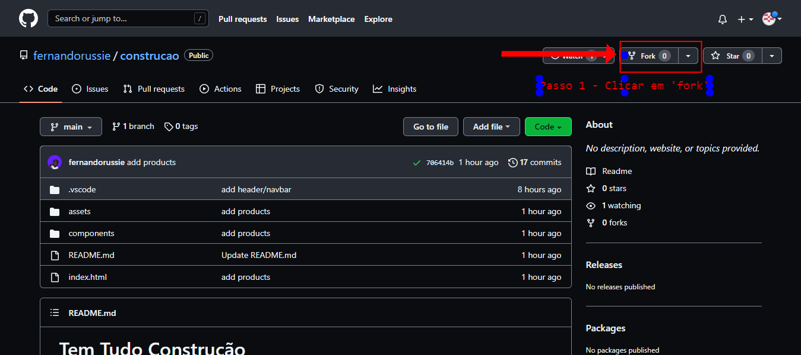
  
* Passo 2: Após clicar em fork, vai abrir essa tela e note que o nome é o mesmo, porém o "owner" terá o seu nome de usuário. Seguindo, podemos clicar em "Create fork", que irá criar um repositório identico para a sua conta, como aparece na imagem abaixo: 

  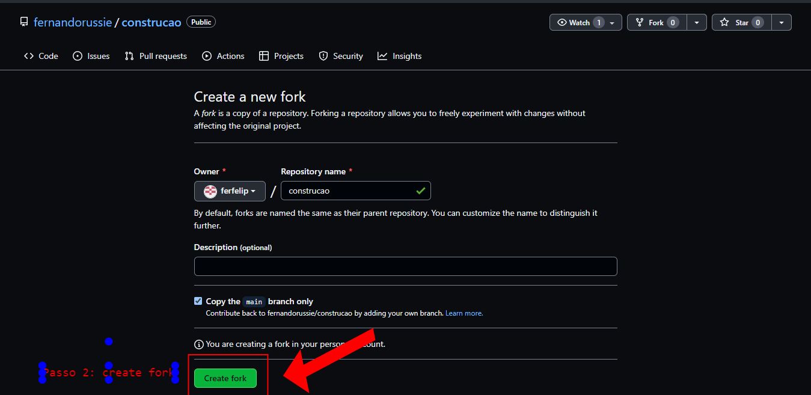
* Passo 3: Já dentro do seu proprio repositório forkeado, note que o nome ali em cima ira aparecer o seu "nome/nome do repositório" e logo abaixo o caminho do repositório original, como aparece na imagem abaixo: 

  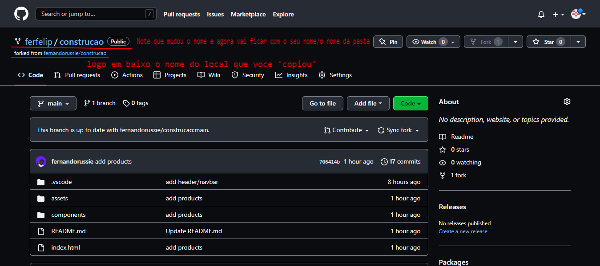
  
  * Passo 3.1: Já dentro do seu proprio repositório forkeado, clique em "Code" para abrir a caixa com o link do clone, como aparece na imagem abaixo: 

  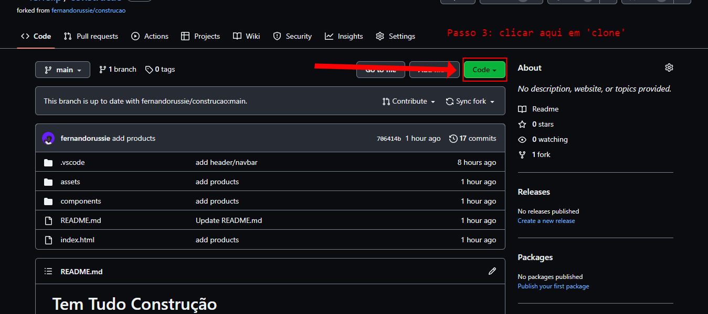
  
* Passo 4: Após clicar em Code e abrir a caixinha, copie o link, como aparece na imagem abaixo: 

  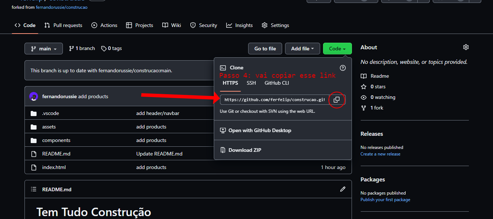
  
* Passo 5: Após copiar o link, abra o terminal "Git Bash" em um local de sua preferencia e digite 'git clone oLinkQueVocêCopiou' e dê "Enter", como aparece na imagem abaixo: 

  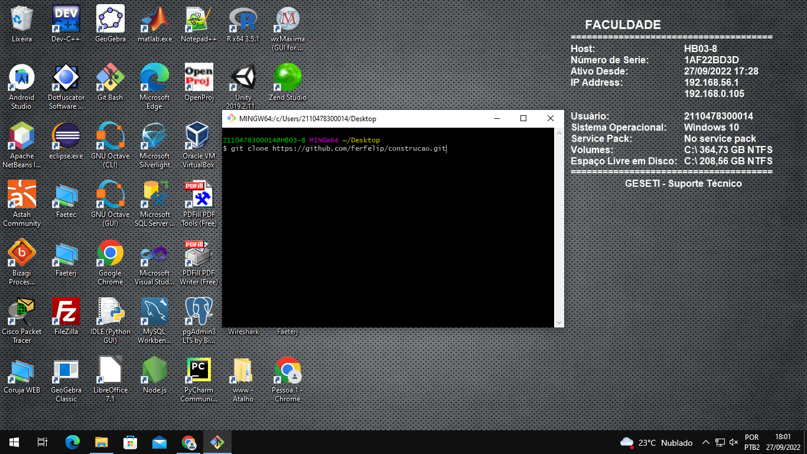
    
  Após dar Enter, irá aparecer essa tela: 
  
  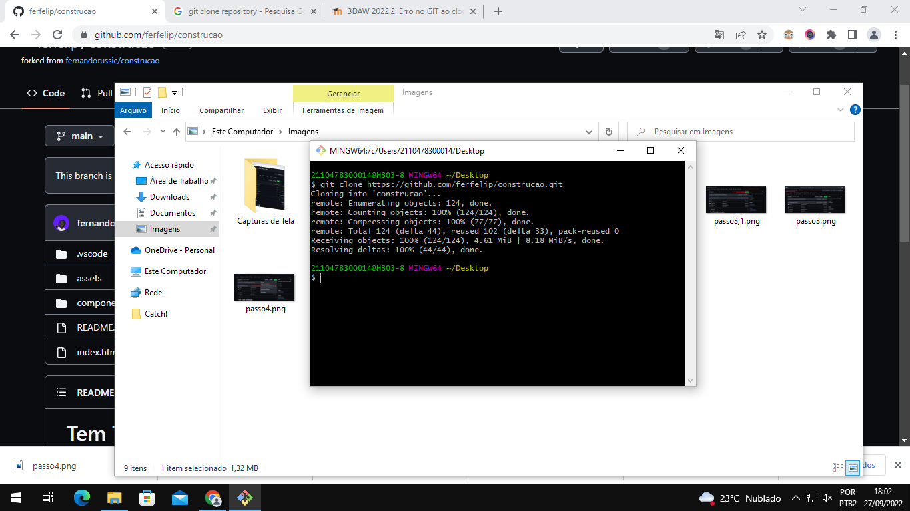
  
  
  <h2>Fluxo GIT:</h2>

 'Git clone apenas na primeira vez para baixar o repositório'

* cd "nome da pasta" ------ o comando 'cd' serve para voce entrar na pasta que deseja( se voce fez git clone na area de trabalho vai aparecer o caminho do arquivo logo em cima)
* Depois vai abrir no VS Code e fazer as suas alterações 
* git status ------ voce verifica se tem alterações na sua pasta e quais são os arquivos alterados
* git add .    ----- voce adiciona os arquivos alterados na fila para enviar para o github
* git commit -m "comentário sobre a atualização"   -  São as marcações da atualização que voce faz no seu repositório local e salva/guarda no repositório online
* git push   - para subir a atualização do seu repositorio local(seu pc) para o repositorio online(repositorio no github)

* git pull - é o comando para atualizar o seu repositório local com os arquivos do repositorio online( exemplo: se o repositorio online estiver mais atualizado do que o seu repositorio na sua maquina, esse comando serve para voce baixar as atualizações existentes no repositorio online para o seu, assim ficando igualmente na mesma versão).
  
  
* Passo 6: Após fazer suas alterações, salve e suba o commit normalmente.
Após subir suas atualizações para o seu repositório, note que a seguinte mensagem aparecerá: "This branch is '1 commit ahead, 1 commit behind'"... nome do repositorio original, como aparece na imagem abaixo: 
  
  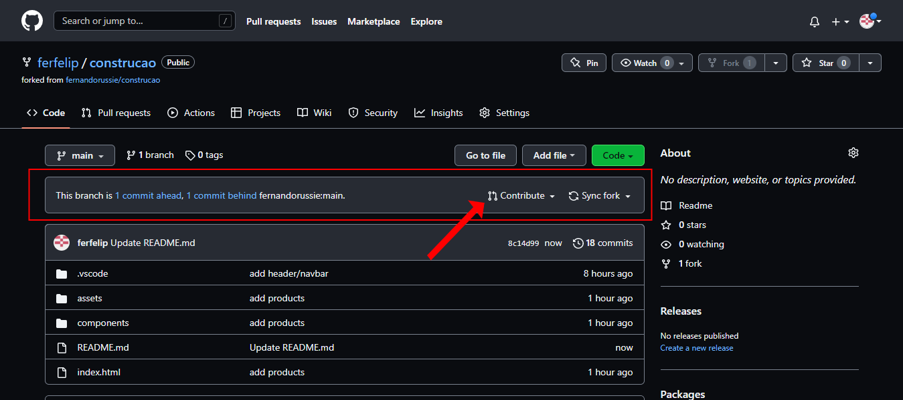
  
* Passo 7: Clique em "Contribute" e depois em "Open pull request", para abrir uma solicitação de atualizar o repositório original, como aparece na imagem abaixo:

  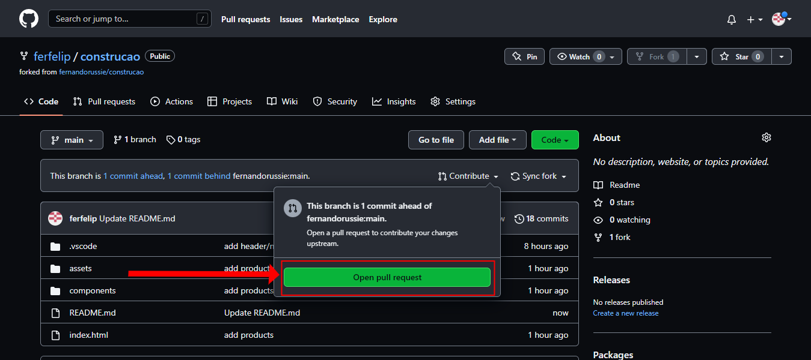
  
* Passo 8: Será redirecionado para outra pagina mostrando a solicitação, você pode alterar o nome do commit e depois clicar em "Create pull request", como aparece na imagem abaixo:

  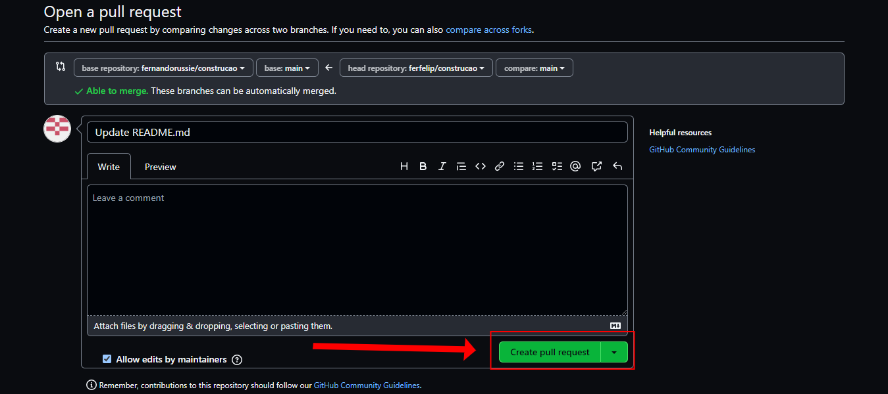
  
* Passo 9: Após confirmar as informações e enviar a solicitação, abrirá essa pagina mostrando algumas informações sobre e tbm o botão de cancelar essa requisição (Close pull request) ,como aparece na imagem abaixo:

  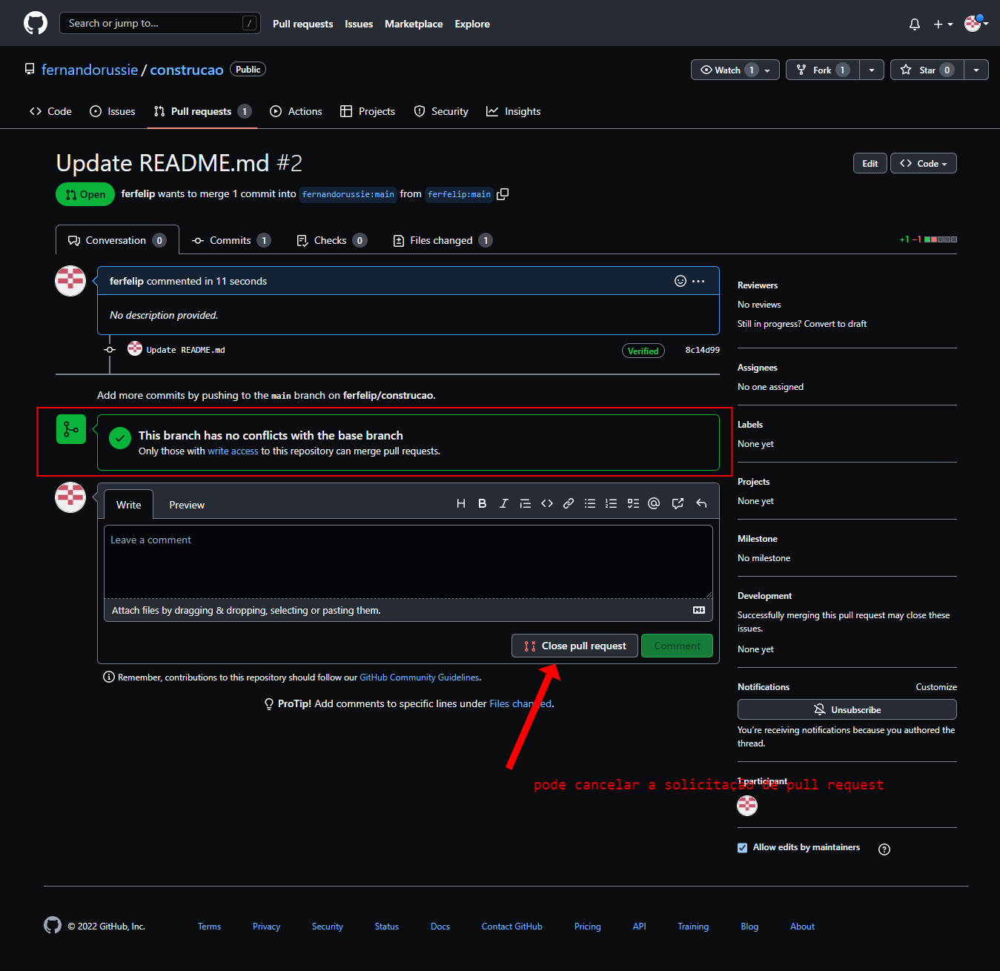
  
    
* Passo 10: Por fim, essas solicitações serão notificadas para o dono do repositório original e ele decidirá se aceita ou não essas atualizações, como aparece na imagem abaixo:

  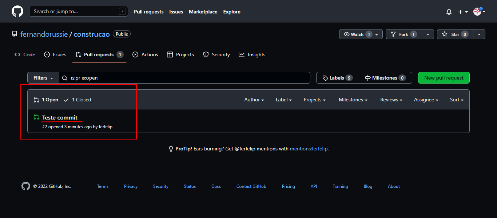
